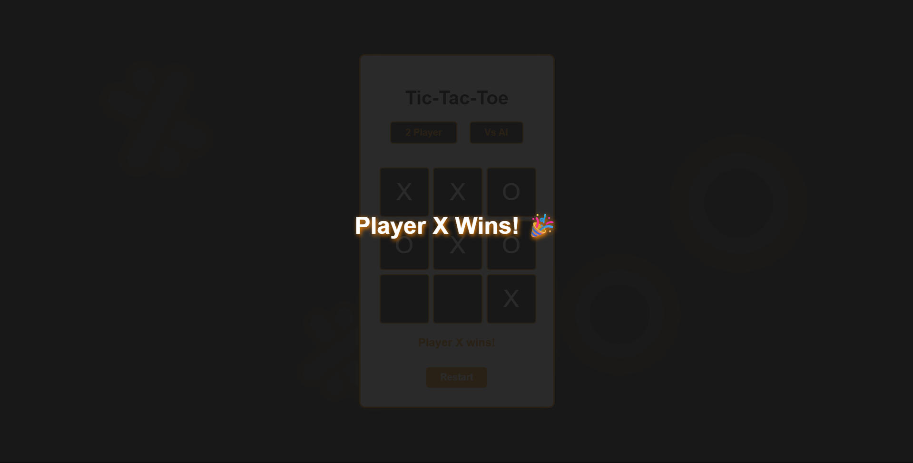

# PRODIGY_WD_03
An interactive Tic-Tac-Toe game built with HTML, CSS, and JavaScript. Playable by two players or against a basic AI, with win detection and game state tracking for a fun and engaging experience.

## About the Project
This project is a modern, visually appealing Tic-Tac-Toe web app featuring:
- Black, orange, and white color scheme for a bold UI
- Playable in two-player mode or against a simple AI
- Win and draw detection with celebration/confetti animations
- Responsive design for desktop and mobile
- Animated and cartoon-style X and O background elements
- Clean, organized file structure

## Features
- Interactive 3x3 game board
- Click to place X or O
- Automatic turn switching
- AI opponent (random move selection)
- Win/draw detection and celebratory overlay
- Restart and mode switch buttons

## Screenshots

